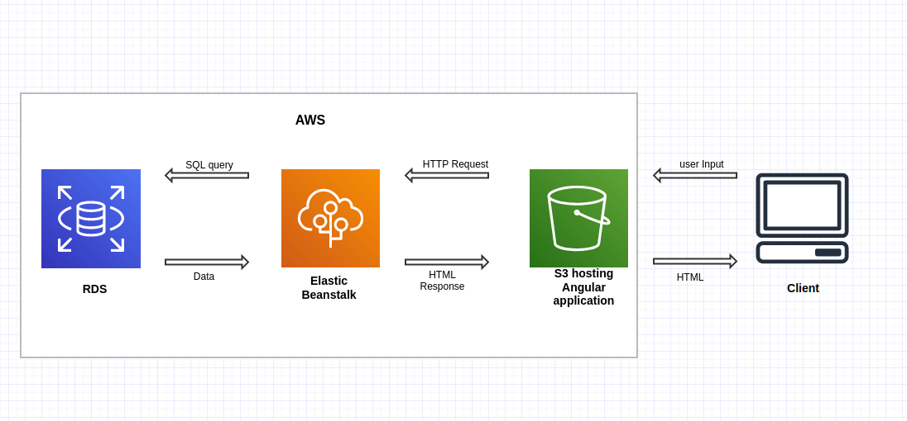

## Infrastructure description

1- the client access the angular application which is hosted on Amazon S3 Bucket

2- the angular front end application call the backend apis through HTTP requests  which is hosted and configured on amazon beanstalk 

3- the amazon beanstalk make SQL queries on the postgres RDS and get the result back

